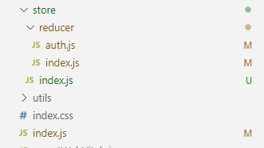
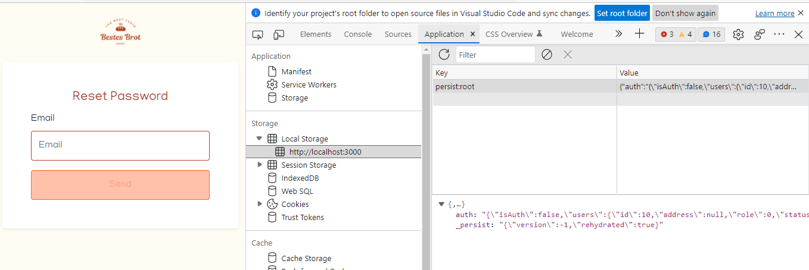
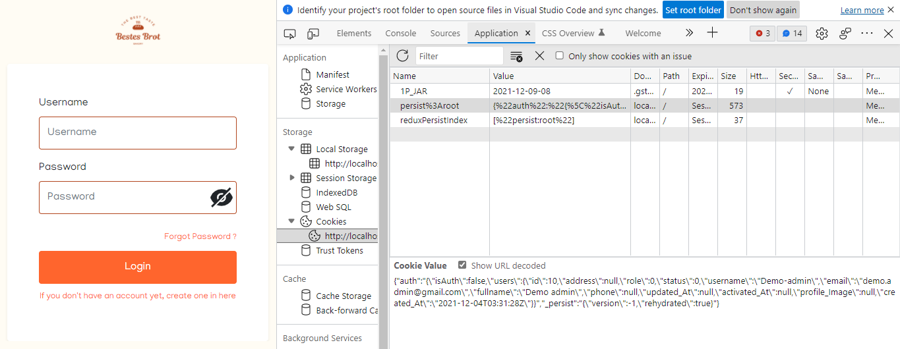

# How implement Redux Persist X Redux Toolkit

## 1. Redux Persist (Local Storage)

### Step 1 - Install Redux persist

```javascript
// install redux-persist
npm install redux-persist --save
// install redux-toolkit
npm install @reduxjs/toolkit --save
```

### Step 2 - Prepare your Dir



1. /src/index.js (Main index)
2. /src/store/ index.js (store configuration)
3. /src/store/reducer/auth.js (reducer auth , "just example")
4. /src/store/reducer/index.js (for combineReducers)

### Step 3 - Create Reducer example => Auth Reducer

dir : /src/store/reducer/auth.js

```javascript
import { createSlice } from "@reduxjs/toolkit";

const initialState = {
    isAuth:false,
    users: {},
};
const authSlice = createSlice ({
    name : "auth",
    initialState : initialState,
    reducers: {
        allUsers(state,data) {
            state.users = data.payload;
        },
        login : (state, data) =>{
            state.users = data.payload;
        }
    }
})

export const authActions = authSlice.actions;
export default authSlice.reducer;
```

### Step 4 - Grouping your reducer with 'combineReducers'

dir : /src/store/reducer/index.js

```javascript
import { combineReducers } from "redux";
import auth from "./auth";
const reducers = combineReducers({
    auth: auth,
    //add another reducer, if you need
});
export default reducers;
```

### Step 5 - Config your store 

dir : /src/store/index.js

```javascript
import {configureStore} from '@reduxjs/toolkit';
import storage from 'redux-persist/lib/storage';// default for Local Storage
import { persistReducer } from 'redux-persist';
import thunk from 'redux-thunk';
import reducers from './reducer';
//Configuration persist your key name, whitelist and blacklist reducer, and storage Engine
const persistConfig = {
    key: 'root',
    storage,
  whitelist:['auth'], //which you want to keep eternal with redux persist :)
  blacklist:['anything-you-want'],//redux list you don't want to keep :(
};

//Set reducer and persist config
const persistedReducer = persistReducer(persistConfig, reducers); 

//Configuration Store
const store = configureStore({
    reducer: persistedReducer,
    middleware: [thunk]
});

export default store;
```

### Step 6 - Set up your main index

dir : /src/index.js

```javascript
import React from "react";
import ReactDOM from "react-dom";
import "./index.css";
import "bootstrap/dist/css/bootstrap.min.css";
import App from "./containers/screens/App";
import { BrowserRouter } from "react-router-dom";
import reportWebVitals from "./reportWebVitals";
import { Provider } from "react-redux";
import store from "./store";
import { persistStore } from "redux-persist";
import { PersistGate } from "redux-persist/integration/react";

let persistor = persistStore(store);
ReactDOM.render(
    <Provider store={store}>
    	{/* PersistGate delays the rendering of your app's UI until your persisted state has been retrieved and saved to redux. */}
        <PersistGate loading={null} persistor={persistor}>
            <BrowserRouter>
                <App />
            </BrowserRouter>
        </PersistGate>
    </Provider>,
    document.getElementById("root")
);

// If you want to start measuring performance in your app, pass a function
// to log results (for example: reportWebVitals(console.log))
// or send to an analytics endpoint. Learn more: https://bit.ly/CRA-vitals
reportWebVitals();

```

### Step 7 - Call your state

Example: 

```javascript
import { useSelector } from "react-redux";
import { authActions } from "../../../store/reducer/auth";
export default function LoginForm() {
  const users = useSelector((state) => {
    return state.auth.users;
  });
  console.log (users)
  }
  .......
```

### Step 8 - Run your app

```
npm start
```

> For Checking
>
> Inspect > application >LocalStorage




## 2. Redux Persist (Cookies Storage) 
maybe this is compatible in all types and versions of browsers

### Step 1 - Install Redux persist cookies store
Previously you had to install redux persit and toolkit bro.. 
Please, Look in the first guide

```javascript
// install redux-persist-cookie-storage
npm install  redux-persist-cookie-storage --save
// you need install cookies js for save your state on your cookie storage engine
npm install cookies-js --save
```

### Step 2 to 4 - Like a  guide 1. Redux Persist (Local Storage), Lets go to Step 5
### Step 5 - Config your store 

dir : /src/store/index.js
```javascript
import {configureStore} from '@reduxjs/toolkit';
import { persistReducer } from 'redux-persist';
import thunk from 'redux-thunk';
import reducers from '../reducer';
import { CookieStorage } from 'redux-persist-cookie-storage'; // Choose Cookie Storage Engine
import Cookies from 'cookies-js'; //libraries to help put your state into cookies

const persistConfig = {
  key: 'root',
  storage : new CookieStorage(Cookies, {}), // Set up Cookie Storage Engine
whitelist:['auth'],
blacklist:['anything-you-want'],
};


const persistedReducer = persistReducer(persistConfig, reducers);

const store = configureStore({
    reducer: persistedReducer,
    middleware: [thunk]
});

export default store;
```

### Step 6 - Set up your main index
dir:/src/index.js

#### What different ???? just import store and declare persistor

```javascript
import React from "react";
import ReactDOM from "react-dom";
import "./index.css";
import "bootstrap/dist/css/bootstrap.min.css";
import App from "./containers/screens/App";
import { BrowserRouter } from "react-router-dom";
import reportWebVitals from "./reportWebVitals";
import { Provider } from "react-redux";
import { persistStore } from "redux-persist";
import { PersistGate } from "redux-persist/integration/react";
import store from "./store/cookie";

let persistor = persistStore(store, {});
ReactDOM.render(
    <Provider store={store}>
        <PersistGate loading={null} persistor={persistor}>
            <BrowserRouter>
                <App />
            </BrowserRouter>
        </PersistGate>
    </Provider>,
    document.getElementById("root")
);

// If you want to start measuring performance in your app, pass a function
// to log results (for example: reportWebVitals(console.log))
// or send to an analytics endpoint. Learn more: https://bit.ly/CRA-vitals
reportWebVitals();

```
And the run your app , after run app check your cookies . for step check cookies
> Inspect > application > Cookie


##### Good Luck , Happy codinggg ..
